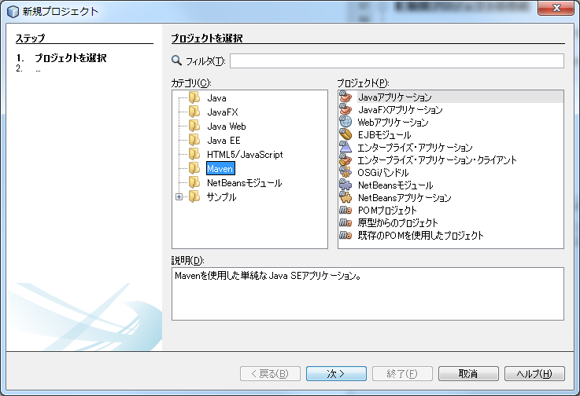
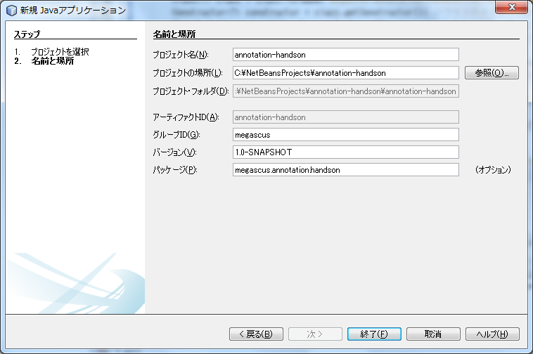

# 0.プロジェクト作成

事前準備としてプロジェクトの作成を行います。

## NetBeansでの新規プロジェクトの作成

NetBeansを立ち上げてない場合は立ち上げてください。

### 新規プロジェクトの作成

+ 左上のファイル→新規プロジェクト(w)を選択します。
+ 新規プロジェクトからMaven→Javaアプリケーションを選択して、次へを押します。
+ プロジェクト名にannotation-handson、グループIDにmegascusを入れて完了を押します。

