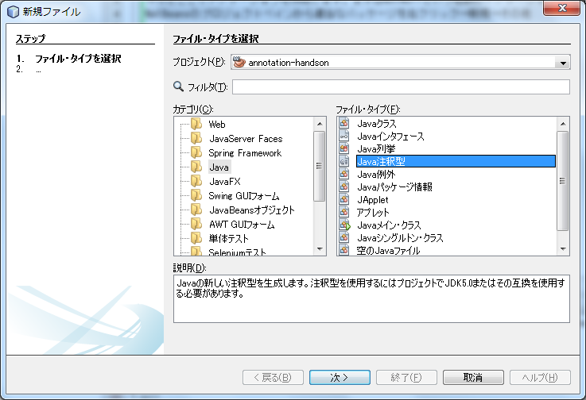

# 3.アノテーションの作成方法

やっとここでアノテーションを作成します。まずはNotNullという名前のアノテーションを作成します。
NetBeansのプロジェクトペインから適当なパッケージを右クリック→新規→その他を選択します。
そこからさらにjava→Java注釈型を選択してください。



クラス名にNotNull、
パッケージ名にmegascus.annotation.handson.beanvalidation
を入力します。

そうすると以下のようなクラスが作成されます。

```java:NotNull.java
package megascus.annotation.handson.beanvalidation;

public @interface NotNull {
    
}
```

アノテーション自体のカスタマイズはあまりないのでまとめて説明します。
以下のように書き直してください。

```java:NotNull.java
package megascus.annotation.handson.beanvalidation;

import java.lang.annotation.Documented;
import java.lang.annotation.ElementType;
import java.lang.annotation.Retention;
import java.lang.annotation.RetentionPolicy;
import java.lang.annotation.Target;

@Target(value={ElementType.FIELD}) //アノテーションを使用できる種別
@Retention(RetentionPolicy.RUNTIME) //実行時に有効(リフレクションを使って読み取ることができる)
@Documented //このアノテーションがついていることをJavaDocに表示する @RetentionがRetentionPolicy.RUNTIME の時はつけておく
//@java.lang.annotation.Inherited アノテーションのターゲットがクラスの場合にサブクラスに伝播させる
public @interface NotNull {
    public String message() default "{0} の値がnullです。";
}

```

アノテーションを作成するのにもアノテーションだらけになりますが、それぞれのアノテーションの意味はコメントに記載したとおりです。